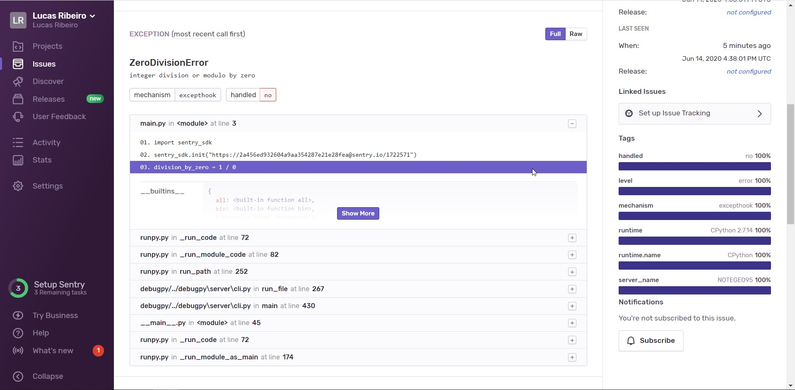

# Integração Sentry e Python
Projeto teste de integração Python e Sentry

<p align="center">
  
</p>

# Visão Geral

O Sentry é uma plataforma de monitoramento de erros que pode ser integrada com várias aplicações/tecnologias.
Abaixo, veja um procedimento simples para integração com arquivos python.

# Procedimentos

Instale o SDK do Sentry no Python
``` console
pip install sentry_sdk
```

Importe o sentry_sdk no projeto
``` python
import sentry_sdk
```

Insira a url/chave do Sentry
``` python
sentry_sdk.init("https://2a456ed932604a9aa354287e21e28fea@sentry.io/1722571")
```

Teste a integração realizando alguma operação inválida
``` python
division_by_zero = 1 / 0
```

Visualize o erro capturado no painel do Sentry.io
<p align="center">
  
</p>